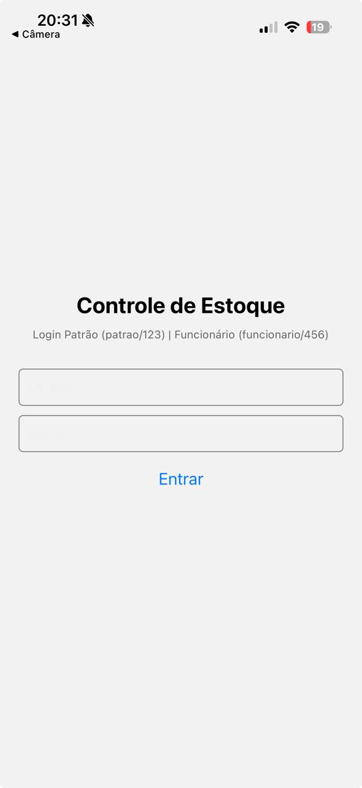
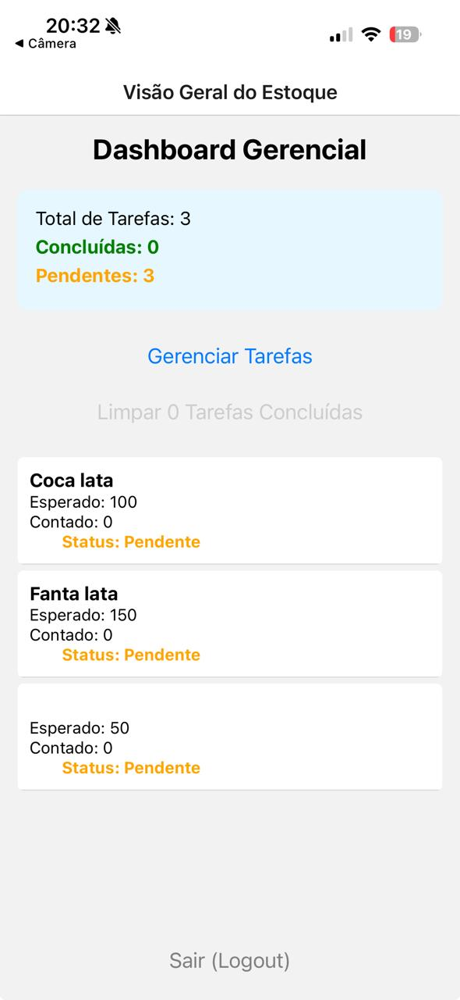
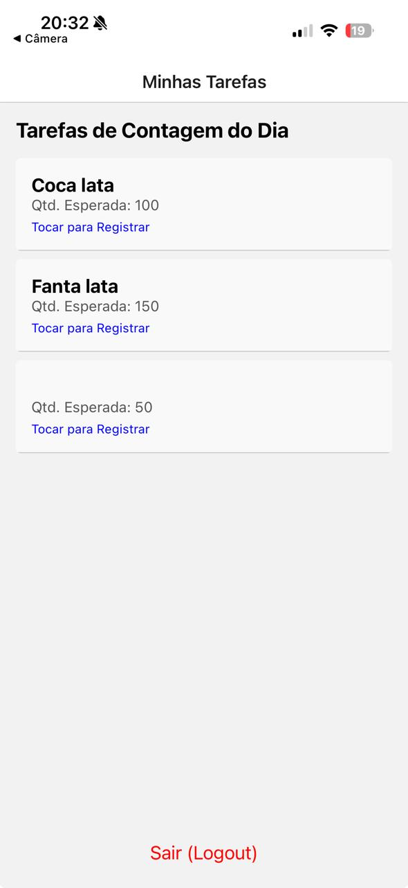

# 📦 Sistema Mobile de Controle e Auditoria de Estoque

Aplicações móveis voltadas para a otimização de processos operacionais e logísticos de armazenamento (**Logística 4.0**). Este projeto consiste em um aplicativo desenvolvido com **React Native** e **Expo** voltado para o gerenciamento, controle e auditoria diária de estoque físico em estabelecimentos comerciais (mercados, lojas ou depósitos).

O sistema resolve problemas de divergência entre o estoque físico e o digital por meio de um fluxo direcionado de auditoria diária, dividindo os privilégios de acesso entre administradores (**Patrão**) e operadores (**Funcionários**).

---

## 👤 Autor do Projeto
* **Anderson De Andrade Dantas** — Desenvolvimento do Setup Técnico (Expo), Criação da Arquitetura de Autenticação Global, Componentização Estrutural, Lógica Reativa com Context API, Telas de Login, Módulos de Operação do Funcionário e Painel Gerencial do Patrão.

---

## 📱 Interface do Aplicativo

Abaixo estão as capturas de tela que demonstram o fluxo de navegação e a separação de escopo por níveis de acesso:

<p align="center">
  
  
  
</p>

* *Figura 1: Tela de Autenticação Unificada.*
* *Figura 2: Dashboard Gerencial do Patrão (com indicadores, listagem em FlatList com scroll dinâmico e limpeza de tarefas).*
* *Figura 3: Listagem de Tarefas Pendentes do Operador/Funcionário.*

---

## 🎯 Problemática & Solução

### Problema Identificado
Pequenos e médios estabelecimentos sofrem com a falta de padronização e ineficiência na contagem de produtos. O registro manual ou a ausência de sistemas descentralizados integrados geram alto tempo gasto pelos funcionários, perdas/desvios não identificados no momento oportuno e total falta de visibilidade em tempo real para o gestor sobre as inconsistências.

### Solução Proposta
Uma solução mobile ágil operando diretamente no ponto de contagem (estoque físico). O aplicativo divide responsabilidades: o gestor cria as demandas de auditoria do dia, o funcionário realiza a contagem física em tempo real no depósito e o sistema consolida as informações automaticamente via estado global, apontando discrepâncias e permitindo ao gestor expurgar históricos concluídos para novos ciclos.

---

## 🚀 Principais Funcionalidades Implementadas

### 🔐 Módulo de Autenticação & Governança de TI
* **Login Condicional:** Fluxo de telas baseado estritamente no perfil do usuário (`Patrao` ou `Funcionario`).
* **Segurança de Rotas:** Uso de React Context API para garantir que o estado de dados e as pilhas de telas (*Stacks*) respeitem estritamente os privilégios do usuário logado.

### 👔 Módulo do Patrão (Gestão e Dashboard)
* **Painel Gerencial:** Indicadores automáticos em tempo real do total de tarefas, contagens pendentes e concluídas.
* **Scroll Otimizado:** Lista de auditoria integrada com rolagem nativa escalável (`FlatList` configurada com restrição de área `flex: 1`).
* **Gerenciador de Tarefas:** Tela dedicada para cadastrar novos produtos definindo as quantidades esperadas em estoque.
* **Expurgo de Histórico:** Função exclusiva para remover tarefas já concluídas do fluxo com um único clique, preparando o sistema para o próximo turno.

### 👷 Módulo do Funcionário (Operação Coletora)
* **Fila de Trabalho Dinâmica:** Exibição clara e exclusiva apenas dos itens que precisam de auditoria física no dia corrente.
* **Registro de Contagem:** Formulário simplificado e adaptado para inserção de dados numéricos rápidos.
* **Atualização Reativa:** Assim que a contagem é confirmada, a tarefa altera seu status globalmente, sumindo da fila do operador e atualizando o painel do gestor.

---

## 🛠️ Tecnologias Utilizadas

* **Framework:** [React Native](https://reactnative.dev/)
* **Ambiente de Desenvolvimento:** [Expo](https://expo.dev/) (Expo Snack Dev)
* **Gerenciamento de Estado Global:** React Context API (`createContext`, `useContext`, `useState`)
* **Navegação Nativa:** React Navigation (`@react-navigation/native`, `@react-navigation/stack`)
* **Linguagem:** JavaScript (ES6+)

---

## 📐 Estrutura de Pastas

```text
├── src/
│   ├── screens/
│   │   ├── Patrao/
│   │   │   ├── DashboardScreen.js
│   │   │   └── GestaoScreen.js
│   │   ├── Funcionario/
│   │   │   ├── TarefasScreen.js
│   │   │   └── RegistroScreen.js
│   │   └── LoginScreen.js
│   └── Context.js
├── images/
│   ├── tela.jpeg
│   ├── patrao.jpeg
│   └── funcionario.jpeg
├── App.js
├── package.json
└── README.md
```
⚙️ Como Executar o Projeto
Opção 1: Via Expo Snack (Web)
Acesse o Expo Snack.

Crie a estrutura de arquivos idêntica à listada acima e cole os respectivos códigos do projeto.

Certifique-se de incluir as dependências @react-navigation/native e @react-navigation/stack no painel de dependências do Snack.

Execute no emulador web ou abra pelo aplicativo Expo Go em seu smartphone utilizando o QR Code.

Opção 2: Localmente
Clone este repositório:

git clone [https://github.com/SEU-USUARIO/NOME-DO-REPOSITORIO.git](https://github.com/SEU-USUARIO/NOME-DO-REPOSITORIO.git)
Instale as dependências:

Bash
   npm install
Inicie o ecossistema do Expo:

Bash
   npx expo start
🔑 Credenciais para Teste (Dados Simulados)
Perfil Patrão:

Usuário: patrao | Senha: 123

Perfil Funcionário:

Usuário: funcionario | Senha: 456
